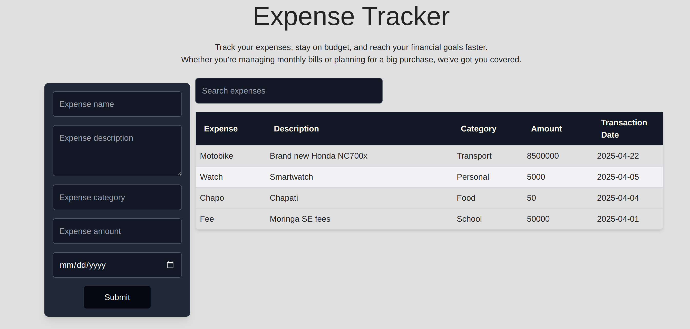

# Expense Tracker

A simple and interactive **Expense Tracker** application built using **React.js** and **TailwindCSS**. This app allows users to add and search for their expenses with ease. It provides a clean, modern interface and offers functionality for searching and filtering expenses.



## Features

- **Add Expenses**: Users can add expense details like name, description, category, amount, and date.
- **Search Expenses**: Users can search expenses by name or category.
- **View Expenses**: All expenses are displayed in a table with the option to filter by categories or names.
- **Responsive Design**: Built with TailwindCSS to ensure the app is responsive on various screen sizes.
- **User-friendly UI**: Interactive forms and a neat design for smooth user interaction.

## Technologies Used

- **React.js**: JavaScript library for building user interfaces.
- **TailwindCSS**: Utility-first CSS framework for custom and responsive styling.
- **React Hooks**: For managing state and handling user inputs efficiently.

## Getting Started

To get a local copy of the project up and running, follow these simple steps:

### Prerequisites

Make sure you have the following installed:

- **Node.js** (Version 12 or above)
- **npm** (Node Package Manager)

### Installation

1. **Clone the Repository**:

   Open a terminal and run the following command to clone the repo:

   ```bash
   git clone https://github.com/Mathew-Rym/expense_tracker.git

   cd expense-tracker

   npm install

   npm run dev

## File Structure

expense-tracker/
├── public/
│   └── index.html
├── src/
│   ├── components/
│   │   ├── Header.jsx           
│   │   ├── Main.jsx          
│   │   ├── Form.jsx           
│   ├── App.js                       
│   ├── index.js                     
│   └── App.css                     
├── tailwind.config.js               
├── package.json                     
└── README.md    


